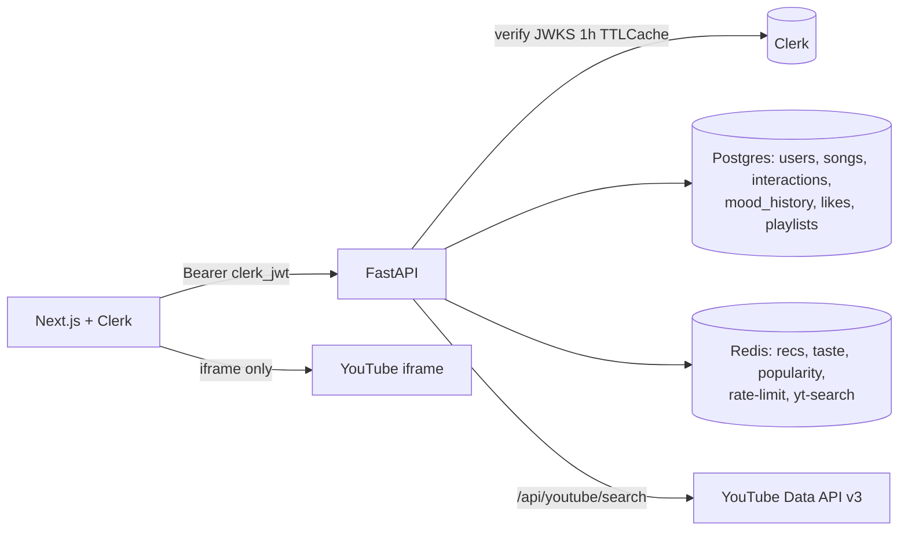

# MoodBeats Implementation Plan

## 1. Project Goal

Ship MoodBeats (Next.js frontend + FastAPI backend + Postgres + Redis) as a
single `docker compose` stack that runs identically on a laptop today and on a
Debian VPS tomorrow. Authentication is Clerk-only; the backend owns all
durable state (users, likes, playlists, interactions, mood history) so
sessions survive browser changes and device swaps.

## 2. Scope

- Single-host Docker Compose stack (`db`, `redis`, `backend`, `frontend`).
- Clerk handles sign-up / sign-in; backend verifies session JWTs via JWKS.
- Postgres stores all durable records. `localStorage` becomes a
  write-through UX cache only.
- Redis is used for recommendation caching, taste-vector caching,
  popularity counters, rate limiting, and the YouTube search proxy.
- YouTube Data API v3 is called server-side only. The API key never
  ships to the browser.
- Alembic owns schema migrations. `create_all` is kept only as a dev
  fallback.

Out of scope: multi-replica backend, licensed audio provider, training
`HybridRecommender`, custom TLS domain (handled by the VPS bootstrap
script).

## 3. Assumptions

- The operator can run Docker Compose on the target host.
- Clerk keys (`CLERK_ISSUER`, `CLERK_SECRET_KEY`, publishable key) and
  `YOUTUBE_API_KEY` are available and will be provided via `.env`.
- The deploy host has enough RAM for Redis (`256 MB` cap) + Postgres +
  the backend + frontend build (typically ~2 GB RSS).

## 4. Architecture

### Request lifecycle

- Every authenticated request carries a Clerk session JWT in
  `Authorization: Bearer ...`. `useApi()` (a React hook backed by
  `@clerk/nextjs`) attaches it transparently on every call.
- The backend verifies signature + `iss` + `exp` against Clerk's JWKS,
  cached in-process for 1h (TTLCache) so we don't hop to Redis on every
  request.
- On first sight, a `users` row is upserted keyed on the Clerk `sub`.

### Recommendation pipeline

- Catalog = 200 seed songs (`external_source='seed'`) + any YouTube
  video the user actually plays or likes (`external_source='youtube'`,
  inserted via `POST /api/songs/upsert`).
- Each song has a 6-D content vector
  `(valence, energy, danceability, tempo/200, acousticness, instrumentalness)`.
- The user taste vector is a weighted L2-normalized sum of vectors from
  positive interactions (`play` scaled by listen completion, `like` and
  `save` weighted higher). Skips add a separate per-song penalty.
- Hybrid score per song = `ALPHA*mood + BETA*taste + GAMMA*popularity +
  DELTA*freshness` with an exact-mood multiplier. `/for-you` drops the
  mood term and folds in a small recency bias from `mood_history`.
- Popularity is read from Redis `mb:pop:play:{song_id}` counters
  (log-normalized across the candidate set) and mixed with the DB
  `Song.popularity` baseline.

### Caching layout

| Namespace                          | TTL          | Invalidated by                                    |
| ---------------------------------- | ------------ | -------------------------------------------------- |
| `mb:reco:mood:{mood}:{limit}`      | 10 min       | `POST /api/songs/upsert` (new catalog entry)       |
| `mb:reco:foryou:{user}:{limit}`    | 5 min        | interact / like / unlike / upsert for that user    |
| `mb:taste:{user}`                  | 1 h          | interact / like / unlike / upsert for that user    |
| `mb:pop:{type}:{song_id}`          | none         | never (ground-truth counters)                      |
| `mb:rl:{actor}:{route}:{minute}`   | 60 s         | self-expiring                                      |
| `mb:yt:search:{sha1(q,limit)}`     | 1 h          | TTL only (queries are idempotent)                  |

All cache reads wrap `redis.asyncio` errors and degrade gracefully:
callers get `None` / empty state, the request still completes against
Postgres. A single WARNING is logged per error-kind per process.

## 5. Task Breakdown

1. Clerk end-to-end (done).
2. Postgres-owned library (likes / playlists / hybrid song upsert) (done).
3. Redis: cache client, rec cache, taste cache, popularity counters (done).
4. Rate-limit middleware (done).
5. Server-side YouTube proxy (done).
6. Alembic `0001_init` + lifespan migration gate (done).
7. Compose + CORS + start script hygiene (done).
8. Backend unit tests for cache / rate limit / YouTube proxy / Clerk
   auth / recommender serialization / upsert features (done).

## 6. Milestones

- **M1 Production-ready Clerk + library**: passwords gone, likes and
  playlists survive reinstalls. (done)
- **M2 Redis live**: `/api/recommendations` serves from cache on repeat
  calls; `cached=true` on the response. (done)
- **M3 One-command stack**: `./scripts/start-local-stack.sh` boots a
  fully configured, health-checked stack; the same compose file runs on
  the VPS via `scripts/debian-vps-bootstrap.sh`. (done)

## 7. Risks

- Clerk JWKS rotation: mitigated by a 1h in-process TTLCache + a
  single-refresh fallback when a `kid` is missing.
- Redis outage: backend degrades to DB reads and skips rate limiting
  rather than 503ing.
- YouTube quota: search results cached 1h; anonymous abuse bounded by
  the 30/min rate-limit bucket.

## 8. Validation Plan

1. `cp .env.example .env` and fill in Clerk + YouTube + Redis values.
2. `./scripts/start-local-stack.sh` -> backend + frontend healthy.
3. Sign in via Clerk -> a row appears in `users` with `clerk_id`.
4. Mood pick -> `/api/recommendations?mood=happy` returns 20 songs;
   second call within 10 min has `cached=true` and measurably lower
   latency.
5. Play a YouTube result -> a new `songs` row exists with
   `external_source='youtube'`; `mb:pop:play:{id}` increments; the
   personal feed ranks neighbors higher.
6. Hammer `/api/songs/*/interact` 200 times in 30 seconds -> first 120
   succeed, the rest return 429 with a `Retry-After` header.
7. Like -> `likes` row persists; swap browsers on the same account -> the
   likes and playlists come back from the server.
8. `docker compose restart redis` -> backend keeps serving (cache=false,
   no rate-limiting), logs one warning per feature, no 500s.

## 9. Recommendation system (product logic)

### Goal

Rank songs using mood context plus learned taste from implicit feedback
stored in `interactions`.

### Where preferences live

- Primary store: PostgreSQL table `interactions` - `play`, `skip`,
  `like`, `save`, optional `listen_duration`, `timestamp`.
- Session context: `mood_history` - last selected mood lightly biases
  the `/for-you` feed.
- Cache: `mb:taste:{user}` stores the normalized 6-D vector and a small
  liked-genres list for 1h. Skip strength is re-derived from Postgres
  on every request (small dict, cheap).

### APIs

- `GET /api/recommendations?mood=...` -> hybrid: mood fit + taste +
  popularity + freshness (auth optional). The primary mood UI loads this
  endpoint (not a hardcoded track list); Redis keys are per-user for
  mood lists. Seed-catalog rows may resolve a YouTube video on first
  play via the existing search proxy when no `audio_url` is present.
- `GET /api/recommendations/for-you` -> authenticated; taste +
  popularity + freshness + small recent-mood bias.

### Future

- Optional FAISS index over trained embeddings (`HybridRecommender`)
  when interaction volume justifies it. Current path is in-memory
  scoring over the catalog.

## 10. Deployment

- **Local** (Linux + Docker):
  - `cp .env.example .env`, fill values.
  - `./scripts/start-local-stack.sh`.
- **Debian VPS**:
  - Same compose file. `scripts/debian-vps-bootstrap.sh` installs
    Docker, clones the repo, writes the `.env`, and runs
    `docker compose up -d`. TLS + domain live in that script.

There is deliberately no Vercel/Render config anymore - one compose
file, one set of env vars, one deploy story.
