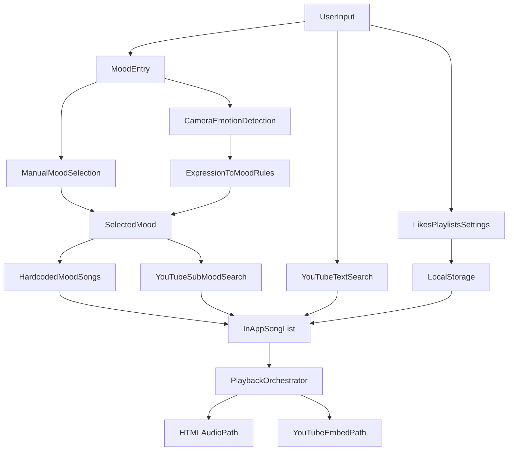

# MoodBeats in Its Current Form: Capabilities, Technology Choices, and the Road to True Recommendation

## Abstract

MoodBeats is a mood-first music web application that aims to make song selection feel immediate, visual, and emotionally aligned. In the current build, the product experience is centered on a Next.js front end that combines curated mood playlists, camera-based emotion detection, YouTube search integration, and a cinematic player UI. The app already presents itself as an intelligent assistant for listening contexts such as studying, workouts, and emotional regulation, but the operational reality is intentionally simpler: song pools are hardcoded, ranking is lightweight and mostly heuristic, and personalization is currently local and shallow. This is not a weakness in itself; it is a practical stage in product evolution.

This paper documents the app as it exists today in the repository, focusing on real behavior rather than aspirational architecture. It examines the web application capabilities, the libraries and frameworks used, the practical algorithmic pipeline currently driving recommendations, and constraints visible in implementation details. It also clarifies a key product truth that should be communicated openly: while there are backend and machine learning modules in the repository, the primary user journey in the live web experience currently relies on client-side logic and hardcoded song datasets rather than a deployed recommendation engine.

The analysis highlights a useful strategic position. MoodBeats already has several production-valuable assets: mood taxonomy, emotional input channel, responsive UX polish, YouTube discovery hooks, and user preference touchpoints (likes, playlists, settings). These can become reliable input signals for a later recommendation layer. The paper closes by outlining a realistic next stage: adding a true recommendation system, preserving the emotional interaction model, and integrating Spotify later for broader catalog and playback continuity.

## 1) Introduction: What MoodBeats Is Solving Right Now

Most listeners do not begin with a song title. They begin with a state: tired, anxious, hyped, nostalgic, focused, or socially energized. MoodBeats is designed around that observation. The app asks for mood first and track second. Rather than forcing users to browse giant catalogs, it narrows the decision space quickly through emotion categories and visual cues. In practice, this means users can enter through manual mood selection or camera-assisted detection, then move directly into playback.

That product choice matters because modern listening fatigue is real. Traditional streaming interfaces optimize for breadth and retention loops, but not always for low-friction emotional fit in the moment. MoodBeats leans toward immediacy. The current implementation uses a finite mood system with distinct visuals and curated songs mapped to each mood. This allows the interface to feel coherent and intentional even without full recommendation infrastructure.

The key scope point for this paper is accuracy. Repository documentation at the root describes an ambitious backend architecture with hybrid recommendation and machine learning components. However, the current front-end journey that users interact with is largely independent of that stack. The Next.js app is the operational center for mood selection, playback control, search, and personalization behaviors. If one goal of research writing is to align expectation with reality, that distinction should be explicit.

MoodBeats should therefore be viewed as a product in transition from "curated emotional playback app" to "emotion-aware personalized recommendation system." Today it reliably delivers the first. It does not yet fully deliver the second.

## 2) Product Capability Snapshot: What Users Can Do Today

### 2.1 Mood-centric entry and navigation

The app is organized as a multi-view single-page experience. The main orchestration is handled in `frontend/src/app/page.tsx`, with states such as `landing`, `home`, `search`, `playing`, `camera`, `media`, and `timeline`. This architecture keeps interaction flow tight and avoids heavy route switching for core actions.

Mood selection is implemented using a compact mood taxonomy defined in `frontend/src/lib/types.ts` and represented in `MOOD_CONFIG`. Current moods include `happy`, `sad`, `gym`, `study`, and `rock`. Each mood has explicit metadata: label, emoji, color, gradient, glow/background classes, icon, and descriptive copy. This is more than cosmetic. The mood configuration acts as a shared contract across UI and playback logic.

### 2.2 Song playback experience

Playback supports two practical modes:

- Native audio where a song has an `audio_url`.
- YouTube embed playback where a song has a `youtube_id`.

In the current setup, sample songs generated in `getSampleSongs` include both a YouTube ID and a fallback/paired audio source pattern. This gives the interface resilience: it can continue functioning even when one source path is limited.

The playback view includes controls for play/pause, previous/next, progress rendering, and expanded immersive states. The UI intentionally invests in "feel": transitions, blurred artwork, animated context, and full-screen/cinema mode behavior. These are not superficial additions; in a mood product, affective continuity between state selection and playback environment is part of perceived intelligence.

### 2.3 Camera-assisted mood detection

MoodBeats includes a camera flow implemented in `frontend/src/components/FaceCamera.tsx`. It uses face-expression estimation to infer an emotional state and map it to one of the app's mood categories. This gives users a low-effort entry mode when they do not want to manually choose mood.

The detection process includes:

- Model loading in-browser.
- Timed scan period and interval sampling.
- Expression accumulation over time.
- Rule-based mapping from expression label to app mood.

The output is a confidence-weighted mood selection, after which the app can auto-start a random song from the corresponding mood list.

### 2.4 YouTube discovery and playback extension

MoodBeats has active YouTube integration in two forms:

1. Embedded YouTube player (`frontend/src/components/YouTubePlayer.tsx`) for playback.
2. YouTube Data API search calls from the main page for query-based discovery and sub-mood refinement.

When users enter search terms, the app can request videos from YouTube and map results to internal song objects. A similar flow exists for sub-mood selection (for example, combining mood label + sub-mood keyword into a search query). This creates a meaningful bridge between fixed local curation and live external discovery.

### 2.5 Lightweight personalization and user memory

Users can like songs, create playlists, remove tracks from playlists, and persist settings such as data saver or visual effect preferences. These are stored in localStorage and keyed by user identity (or anonymous fallback).

The app therefore does retain user behavior, but only in local client storage at present. This is a useful transitional design because it gives immediate personalization signals without requiring full backend recommender coupling.

### 2.6 Timeline and experience continuity

The app keeps a mood history timeline (24-hour window) persisted locally, allowing users to reflect on emotional listening context over time. While not yet a recommendation signal in model training, this timeline is conceptually strong: it can become a high-value feature for behavioral recommendation, wellbeing analytics, or adaptive sequencing later.

## 3) Technology Stack and Library Decisions

### 3.1 Core platform

The front end is built on:

- Next.js 14
- React 18
- TypeScript

These choices support componentized UX, robust typing for song/mood contracts, and straightforward deployment patterns for modern web apps.

### 3.2 UI architecture and styling

MoodBeats relies on:

- Tailwind CSS for utility-driven styling.
- Radix UI primitives for interaction components.
- Supporting utilities such as `class-variance-authority`, `clsx`, and `tailwind-merge`.

This stack is common in production UI systems where iteration speed and component consistency are both priorities. In MoodBeats, it supports a dense interaction surface: dialogs, menus, sliders, popovers, and adaptive containers.

### 3.3 Motion and visual identity

The app uses Framer Motion for animated transitions and dynamic visual feedback. This matters in this domain because mood products benefit from smooth context shifts. Motion reduces discontinuity when moving between selection, camera detection, and playback.

Background components such as shader and star-drop effects reinforce mood immersion. The app also includes fullscreen and orientation-aware player behavior, which improves media experience on mobile and tablet contexts.

### 3.4 Authentication and user layer

The current visible auth shell is based on Clerk (`@clerk/nextjs`) with hooks like `useUser` and `useClerk`, and provider wiring in layout. This gives reliable account identity with minimal auth boilerplate in UI code.

A separate API client (`frontend/src/lib/api.ts`) also exists for JWT-style backend endpoints (`/api/auth`, `/api/recommendations`, etc.). In the current front-end main flow, this appears secondary/legacy relative to Clerk-driven behavior. Mentioning this duality is important because it signals architectural transition rather than inconsistency.

### 3.5 Computer vision dependency

Camera mood detection is powered by `@vladmandic/face-api`. In this implementation, models are loaded from a CDN and executed client-side. This has three practical implications:

- Privacy can be stronger if no raw frames are sent to server.
- Device/browser capability becomes part of feature reliability.
- Initial model loading time affects first-run UX.

The code includes defensive handling for camera/security constraints, including messaging around secure contexts for camera access.

### 3.6 External media integrations

YouTube is currently the primary live media integration:

- YouTube Data API v3 for search.
- Embedded player URLs for in-app playback.

This gives MoodBeats immediate catalog reach without maintaining a licensed media store. It also introduces known constraints: API key handling, quota limits, and dependence on third-party content availability.

Spotify is not yet integrated in the current front-end implementation. It is a stated future direction and should be treated as roadmap, not current capability.

## 4) Data Sources and Content Strategy in the Current Build

### 4.1 Hardcoded mood libraries as operational backbone

The most important implementation fact is simple: current songs are hardcoded in front-end code (`getSampleSongs` in `page.tsx`). The mood datasets are manually curated arrays per mood with fields such as title, artist, album, and YouTube video IDs. The mapping then constructs full `RecommendedSong` objects expected by UI components.

This approach provides strong short-term advantages:

- Predictable quality and tone per mood.
- Fast local rendering without backend latency.
- Controlled demos and deterministic UX.

But it also sets a ceiling:

- Catalog breadth is limited by manual updates.
- Discovery is weak without external search.
- Personalization cannot exceed shallow reordering heuristics.

### 4.2 Metadata synthesis for UI compatibility

The song objects include fields typically associated with recommendation outputs (`score`, `mood_match`, `user_similarity`), but in current flow these values are synthetic placeholders derived from simple index-based logic. That is acceptable for UI continuity during early product stages, but it should not be confused with model-driven scoring.

Similarly, some attributes (valence, energy, danceability, popularity) are generated numerically in deterministic patterns, not estimated from actual audio analysis in this front-end path. These fields are useful scaffolding and can later be replaced with real features from audio metadata services or model pipelines.

### 4.3 Mixed playback assets

The generated song objects include:

- `youtube_id` from curated video IDs.
- `audio_url` sourced from a rotating list of safe public MP3 links.
- `cover_url` synthesized via Picsum seeds.

This hybrid strategy is pragmatic during product prototyping. It ensures there is almost always something playable or displayable, even if one path fails. It also decouples UI exploration from content licensing complexity in early stages.

### 4.4 YouTube as dynamic extension layer

When users search or refine by sub-mood, the app fetches YouTube results and maps them into local song objects. This gives users some "live internet" feeling, reducing the static feel of hardcoded mood lists.

It is worth noting that these fetched entries still enter the same local object contract. That consistency is useful: it means future recommender outputs, Spotify results, and YouTube entries can all flow through the same rendering and control surface if the data interface is preserved.

### 4.5 Current user data persistence model

Likes, playlists, and settings are persisted in localStorage. This has immediate usability benefits and low implementation overhead, but carries clear tradeoffs:

- Cross-device consistency is limited.
- Data durability depends on browser storage state.
- Recommendation-grade event history is not centralized.

Despite these constraints, this local layer is valuable as a behavioral prototype. It shows what user signals are easy to collect and how they influence perceived product quality.

## 5) Algorithmic Logic: What Is Actually Intelligent Today

The current MoodBeats pipeline is best described as a collection of structured heuristics and interaction algorithms, not a trained recommendation engine. That distinction is important, but it does not diminish engineering value. Heuristics are often the fastest path to validating product fit before heavy ML investment.

### 5.1 Emotion detection pipeline (camera mode)

The camera algorithm follows a clear sequence:

1. Start webcam stream.
2. Load face detection and expression models.
3. Sample detections periodically during a scan window.
4. Aggregate expression confidence values.
5. Select dominant expression.
6. Map expression to a fixed app mood.
7. Trigger mood flow and auto-play candidate.

The expression-to-mood mapping table is hardcoded. Example pattern: `happy` and `surprised` map to happy; `neutral` maps to study; `angry` and `disgusted` map to rock. This is a rule-driven classifier layer on top of model-generated expression probabilities.

### 5.2 Mood-to-song retrieval algorithm

After mood selection (manual or camera), retrieval is currently list-based:

- Pull mood-specific array from hardcoded sample data.
- Convert to `RecommendedSong` shape.
- Optionally apply tiny rank adjustment for liked items.
- Set resulting list as active songs.

No nearest-neighbor retrieval, no collaborative latent factors, and no online learning are part of the active front-end recommendation path.

### 5.3 Simple personalization heuristic

The "personalization" currently implemented includes:

- Liked-song boost when ordering the selected mood list.
- Random initial song selection after camera-based mood detection.

This can improve subjective relevance, but it is intentionally limited. It does not infer long-term preference vectors or sequence models.

### 5.4 YouTube search-to-playlist mapping

For text and sub-mood discovery, the app sends a query to YouTube Data API search endpoints and maps returned video items to internal song objects. Ranking mostly follows API order, with slight synthetic score decay by index.

This gives a pseudo-recommendation experience in UI terms because users can discover tracks beyond the static set. But technically, recommendation responsibility is outsourced to YouTube search ranking, not MoodBeats learning logic.

### 5.5 Playback orchestration logic

The playback pipeline contains practical control logic to keep UX coherent:

- Use YouTube embed when video ID exists.
- Fall back to local audio where needed.
- Handle next/previous based on in-memory list indexing.
- Track progress and duration in local state.

The current YouTube component uses an iframe with `enablejsapi=0`, so precise player-state telemetry is not available through YouTube JS API callbacks. To keep UI moving, progress is simulated in timed intervals (roughly four-minute placeholder progression). This is a deliberate compromise: smooth UI continuity over exact media telemetry.

## 6) Architecture Reality Check: Current Web Flow vs Repository-Wide Ambition

A credible technical paper should acknowledge both what exists and what is currently wired into user flow.

Repository-level artifacts include backend routers, schemas, and machine-learning modules (including hybrid model references, embeddings, and index components). Root documentation discusses a fuller recommendation architecture with FastAPI, Redis/PostgreSQL patterns, and ML ranking goals.

However, in practical web-app behavior today:

- Main recommendation list comes from front-end hardcoded data.
- Camera mood detection and local heuristics drive selection.
- YouTube search provides dynamic extension.
- User preference memory is localStorage-based.

This does not mean backend/ML work is irrelevant. It means integration is incomplete from an end-user path perspective. If public communication blurs this line, users may expect personalization depth that is not currently delivered.

A stronger positioning statement for the present would be:

"MoodBeats currently offers mood-driven curated playback with camera-assisted mood input and YouTube-assisted discovery. A full recommendation engine is planned as the next evolution."

That framing is accurate, defensible, and still compelling.

## 7) Limitations in the Current System

### 7.1 Recommendation depth is not yet model-driven

Because songs are hardcoded and ranking is mostly fixed, the system does not adapt deeply to evolving user taste. It can remember likes locally but cannot infer nuanced preference shifts across sessions, devices, or similar-user behavior.

### 7.2 Catalog scalability constraints

Manual curation is manageable at small scale but expensive to maintain as genres, languages, and cultural contexts expand. Without ingestion pipelines, freshness and diversity eventually degrade.

### 7.3 Data architecture limitations

Local-only behavior tracking limits long-term analytics and true personalization. It also complicates trust metrics like "why this song" explanations that depend on historical event context.

### 7.4 Third-party dependency pressures

YouTube search and embed reliance introduces:

- API quota and key management concerns.
- Content volatility if videos become unavailable.
- Limited control over metadata consistency.

### 7.5 Playback telemetry precision

Simulated progress in YouTube playback path can create mismatch between perceived and actual position, especially for skip/replay behavior. This affects both UX confidence and future analytics quality if playback data is later used for learning.

### 7.6 Mood inference ambiguity

Face expression mapping to listening mood is useful but imperfect. Human emotional states are contextual, culturally variable, and often multi-dimensional. A single detected expression should be treated as a hint, not ground truth.

## 8) Future Work: Recommendation Engine and Spotify Integration

MoodBeats is well-positioned for an upgrade path because many user-facing primitives already exist. The next stage should preserve current strengths (speed, emotional UX, clarity) while adding recommendation intelligence behind the scenes.

### 8.1 Recommendation system roadmap

A practical phased path:

1. **Event instrumentation**  
   Standardize interactions: play start, skip, completion ratio, like/unlike, playlist add/remove, mood selection source, search query context.

2. **Server-side profile layer**  
   Move key user preference signals from localStorage to backend profiles while retaining local cache for responsiveness.

3. **Candidate generation**  
   Build candidate pools from curated catalog + external sources; use mood as strong prior.

4. **Ranking model introduction**  
   Start with hybrid scoring: mood compatibility + behavior similarity + freshness + popularity calibration. Transition from static synthetic fields to real features.

5. **Online evaluation loop**  
   Measure skip rate reduction, session length quality, and repeat engagement by mood context.

6. **Explainability surface**  
   Add lightweight reasons ("Because you liked X in Study mode") to increase trust.

### 8.2 Spotify integration roadmap (later phase)

The paper requirement explicitly states YouTube API is connected now and Spotify will be integrated later. That path is coherent.

Spotify integration can provide:

- Broader catalog depth.
- Cleaner track metadata consistency.
- Potential account-linked continuity for users already on Spotify.

Likely implementation tracks include:

- OAuth-based account linking.
- Track search and metadata resolution.
- Playback strategy selection (Web Playback SDK vs deep links depending on policy, premium requirements, and browser support).
- Catalog reconciliation between YouTube-derived tracks and Spotify canonical IDs.

This should be treated as staged integration, not a drop-in switch. The data contract used today in `RecommendedSong` can serve as a translation layer while backend identity and recommendation infrastructure mature.

## 9) High-Level Data Flow of Current MoodBeats

This diagram reflects the present architecture where mood and search inputs feed a local song object pipeline, and personalization signals remain client-side.

## 10) Conclusion

MoodBeats already demonstrates a strong product instinct: begin from emotion, keep interaction fast, and make listening feel immersive. The current app is not a full recommendation platform yet, but it is not pretending to be empty either. It contains working components that matter: mood taxonomy, camera-assisted entry, dynamic YouTube discovery, user preference capture, and polished playback UX.

The most important statement for stakeholders is straightforward: songs are currently hardcoded in the primary front-end flow, and a true recommendation system is still to be added. This clarity is not a liability. It is a strategic asset because it aligns development promises with observable behavior.

From an engineering perspective, MoodBeats has crossed the hardest early threshold: it already has a usable interaction model that people can understand in seconds. The next chapter is to preserve that simplicity while deepening intelligence under the hood. If the team incrementally introduces a recommender layer, centralizes behavioral signals, and later integrates Spotify in a policy-aware way, MoodBeats can evolve from a mood-themed player into a genuinely adaptive emotional listening platform.

In short, the current capabilities are real, the limitations are visible, and the roadmap is credible. That is exactly the kind of foundation on which robust recommendation systems are typically built.
