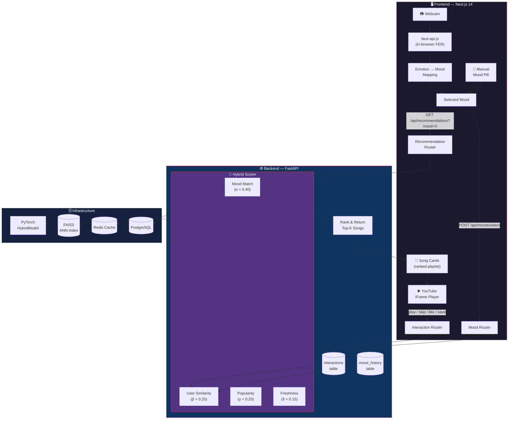
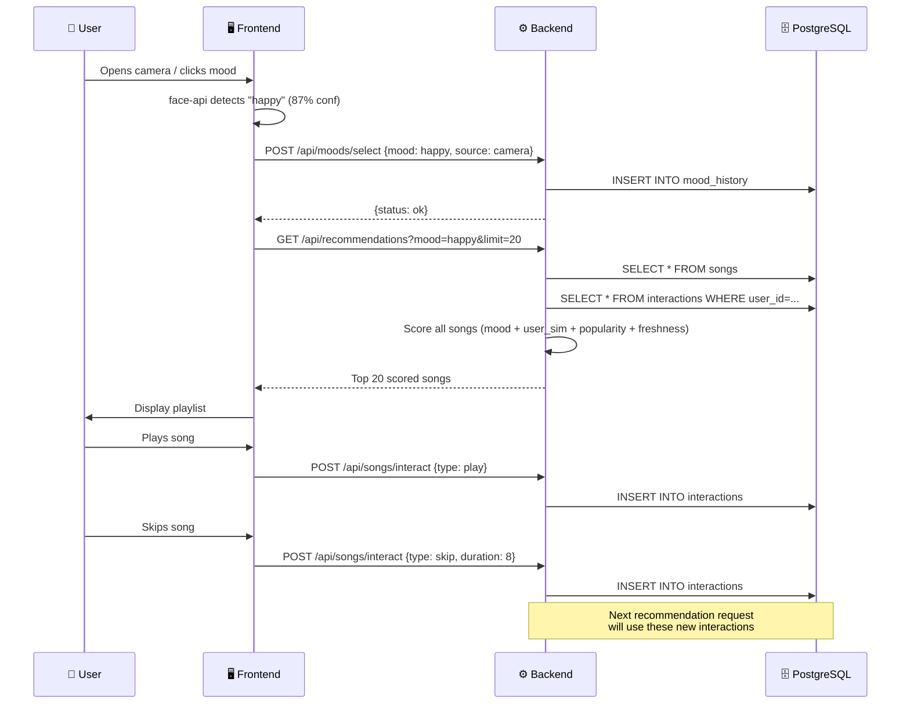
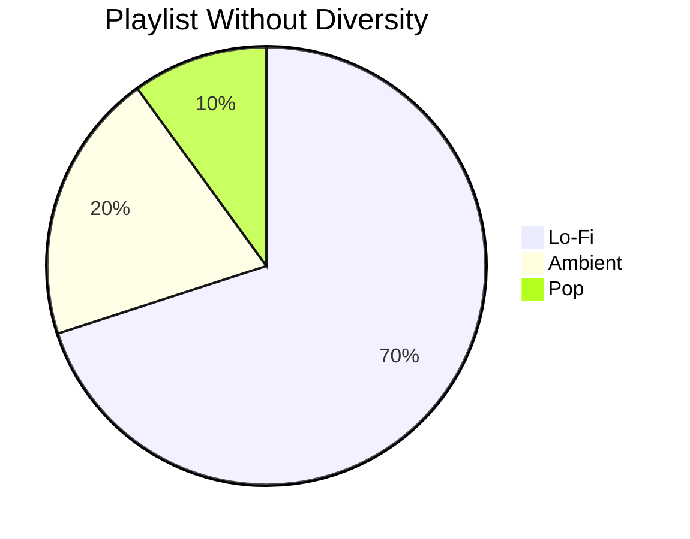
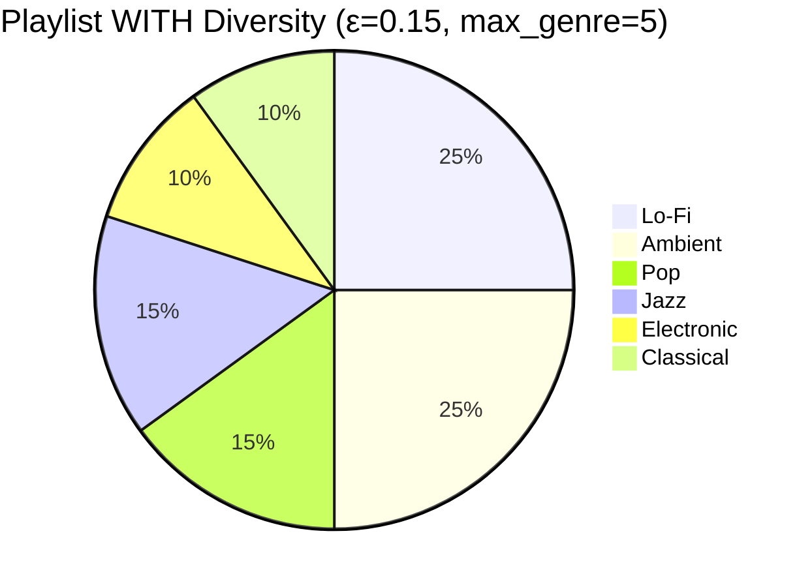

# 🎵 MoodBeats Recommendation System — Complete Guide

> **What this document covers**: How the recommendation engine works end-to-end, how it learns from user behaviour, how to integrate the YouTube Data API for real music sourcing, and production-ready code for every component.

---

## Table of Contents

1. [High-Level Architecture](#1-high-level-architecture)
2. [How It Works — The Recommendation Pipeline](#2-how-it-works--the-recommendation-pipeline)
3. [How User Preferences Are Tracked](#3-how-user-preferences-are-tracked)
4. [How the System Learns and Improves](#4-how-the-system-learns-and-improves)
5. [The Hybrid Scoring Formula (Current)](#5-the-hybrid-scoring-formula-current)
6. [Real-World Walkthrough — A Complete User Session](#6-real-world-walkthrough--a-complete-user-session)
7. [Exploration & Diversity — Breaking Filter Bubbles](#7-exploration--diversity--breaking-filter-bubbles)
8. [Heuristic vs Neural — When to Use What](#8-heuristic-vs-neural--when-to-use-what)
9. [Upgrading to the PyTorch Neural Recommender](#9-upgrading-to-the-pytorch-neural-recommender)
10. [FAISS Vector Search for Fast Retrieval](#10-faiss-vector-search-for-fast-retrieval)
11. [YouTube Data API v3 Integration](#11-youtube-data-api-v3-integration)
12. [Putting It All Together — Full Implementation](#12-putting-it-all-together--full-implementation)
13. [Database Migrations](#13-database-migrations)
14. [Caching with Redis](#14-caching-with-redis)
15. [Cold-Start & Edge Cases](#15-cold-start--edge-cases)
16. [API Reference](#16-api-reference)
17. [Testing the Recommendation System](#17-testing-the-recommendation-system)
18. [Future Enhancements](#18-future-enhancements)

---

## 1. High-Level Architecture



The system has **three layers**:

| Layer | Purpose | Tech |
|-------|---------|------|
| **Perception** | Detect user's mood from face or manual input | `@vladmandic/face-api`, React |
| **Intelligence** | Score & rank songs based on mood + history | PyTorch, FAISS, NumPy |
| **Delivery** | Stream music, capture feedback | YouTube IFrame API, FastAPI |

---

## 2. How It Works — The Recommendation Pipeline

When a user selects a mood (manually or via camera), the following happens step-by-step:

### Step 1: Mood Capture
```
Camera → face-api detects emotion → EMOTION_TO_MOOD map → mood label
   OR
User clicks a mood pill → mood label directly
```

The frontend calls:
```http
POST /api/moods/select
{
  "mood": "happy",
  "source": "camera",      // or "manual"
  "confidence": 0.87
}
```

### Step 2: Record Mood in History
The backend records this in the `mood_history` table for trend analysis:

```python
# backend/app/services/recommendation_service.py
async def record_mood(db, user_id, mood, source, confidence):
    entry = MoodHistory(
        user_id=user_id, mood=mood,
        source=source, confidence=confidence
    )
    db.add(entry)
    await db.flush()
```

### Step 3: Fetch Recommendations
The frontend immediately requests:
```http
GET /api/recommendations?mood=happy&limit=20
```

### Step 4: Hybrid Scoring
For **every song** in the database, the engine computes four sub-scores and blends them:

| Signal | Weight | What It Measures |
|--------|--------|------------------|
| **Mood Match (α=0.4)** | 40% | How close the song's audio features (valence, energy, danceability) are to the mood's ideal profile |
| **User Similarity (β=0.25)** | 25% | How well the song's genre matches genres the user has previously liked/played |
| **Popularity (γ=0.2)** | 20% | Global popularity normalized 0-1 |
| **Freshness (δ=0.15)** | 15% | Recency — newer releases score higher (exponential decay over 2 years) |

### Step 5: Return Ranked Songs
Songs are sorted by `final_score` descending, and the top `limit` songs are returned with their scores.

### Step 6: Playback + Feedback Loop
As the user plays, skips, or likes songs, those interactions are logged and **immediately influence future recommendations** via the User Similarity score.



---

## 3. How User Preferences Are Tracked

### 3.1 The Interaction Model

Every user action on a song is recorded in the `interactions` table:

```python
# backend/app/models/interaction.py
class Interaction(Base):
    __tablename__ = "interactions"

    id          → UUID primary key
    user_id     → FK to users.id (indexed)
    song_id     → FK to songs.id (indexed)
    interaction_type → "play" | "skip" | "like" | "save"
    listen_duration  → float (seconds listened)
    timestamp   → datetime
```

**What each interaction type means for the recommender:**

| Type | Signal | Weight | Impact |
|------|--------|--------|--------|
| `like` | Explicit positive feedback | **3.0×** | Strongest signal — user actively expressed preference |
| `save` | Added to playlist/library | **2.0×** | Strong positive intent |
| `play` | User chose to listen | **1.0×** (base) | Positive, but can be refined by `listen_duration` |
| `skip` | User skipped within seconds | **−0.5×** | Negative signal — should penalize that genre/style |

### 3.1.1 Implicit Feedback from `listen_duration`

The `listen_duration` field is already tracked in the `Interaction` model but is **not yet used in scoring**. This is a wasted signal. Here's how to use it:

```python
def compute_implicit_score(interaction: Interaction, song_duration: int) -> float:
    """
    Convert raw listen_duration into an implicit preference signal.
    
    Logic:
    - Listened to < 15% of song  → Dislike (0.0 - 0.2)
    - Listened to 15-50%         → Neutral (0.3 - 0.5)
    - Listened to 50-85%         → Liked (0.5 - 0.8)
    - Listened to > 85%          → Loved (0.8 - 1.0)
    - Replayed (duration > song)  → Strong signal (1.0)
    """
    if not interaction.listen_duration or song_duration == 0:
        return 0.5  # Unknown → neutral
    
    ratio = interaction.listen_duration / song_duration
    
    if ratio > 1.0:     # Replayed
        return 1.0
    elif ratio > 0.85:  # Listened to almost all
        return 0.8 + 0.2 * (ratio - 0.85) / 0.15
    elif ratio > 0.50:  # Listened to most
        return 0.5 + 0.3 * (ratio - 0.50) / 0.35
    elif ratio > 0.15:  # Partial listen
        return 0.3 + 0.2 * (ratio - 0.15) / 0.35
    else:               # Quick skip
        return 0.2 * ratio / 0.15
```

**Why this matters:** A user who plays a song but skips at 5 seconds is NOT the same as a user who listens to the full 3 minutes. Without `listen_duration`, both look identical in the current system.

### 3.1.2 Time-Decay on Interactions

The current system treats a "like" from 6 months ago the same as one from today. Add exponential decay:

```python
def compute_interaction_weight(
    interaction: Interaction,
    half_life_days: float = 30.0,
) -> float:
    """
    Recent interactions matter more than old ones.
    Half-life of 30 days means a 30-day-old interaction
    has half the weight of a brand new one.
    """
    age_days = (datetime.utcnow() - interaction.timestamp).total_seconds() / 86400
    decay = np.exp(-0.693 * age_days / half_life_days)  # 0.693 = ln(2)
    
    # Combine with interaction type weight
    type_weights = {"like": 3.0, "save": 2.0, "play": 1.0, "skip": -0.5}
    base_weight = type_weights.get(interaction.interaction_type, 1.0)
    
    return base_weight * decay
```

**Example:**
```
A "like" today:          3.0 × 1.00 = 3.00  ← Full weight
A "like" 30 days ago:    3.0 × 0.50 = 1.50  ← Half weight
A "like" 90 days ago:    3.0 × 0.125 = 0.375 ← Fading
A "play" today:          1.0 × 1.00 = 1.00
A "skip" today:         -0.5 × 1.00 = -0.50 ← Penalized
```

### 3.2 The Mood History Model

```python
# backend/app/models/interaction.py
class MoodHistory(Base):
    __tablename__ = "mood_history"

    id          → UUID primary key
    user_id     → FK to users.id
    mood        → "happy" | "sad" | "gym" | "study" | "rock"
    source      → "manual" | "camera" | "text"
    confidence  → float (0.0 - 1.0)
    timestamp   → datetime
```

This table enables:
- **Mood Timeline** visualization in the frontend (last 24h of emotional state)
- **Trend Analysis** — e.g., user is usually "study" at night → pre-suggest study playlists
- **Confidence Weighting** — camera-detected moods have variable confidence; manual are always 1.0

### 3.3 How Past Preferences Feed Back In

The current `get_recommendations()` function in `recommendation_service.py` does this:

```python
# 1. Fetch last 50 interactions for the user
user_interactions = await db.execute(
    select(Interaction)
    .where(Interaction.user_id == user_id)
    .order_by(desc(Interaction.timestamp))
    .limit(50)
)

# 2. Extract positive interactions (play, like, save)
liked_song_ids = {
    i.song_id for i in user_interactions
    if i.interaction_type in ("like", "save", "play")
}

# 3. Get the genres of those liked songs
liked_genres = [ls.genre for ls in liked_songs]

# 4. For each candidate song, compute genre overlap
matching_genres = sum(1 for g in liked_genres if g == song.genre)
user_sim = min(1.0, 0.3 + 0.7 * matching_genres / max(len(liked_genres), 1))
```

**In plain English:** If a user has been playing a lot of "Lo-Fi" genre songs, the system gives a higher `user_similarity` score to other Lo-Fi songs, effectively learning that this user prefers Lo-Fi.

---

## 4. How the System Learns and Improves

There are **two levels** of learning in MoodBeats:

### Level 1: Heuristic Learning (Currently Active)

This is what `recommendation_service.py` does today — **no model training needed**:

```
User plays 5 rock songs → liked_genres = ["rock", "rock", "rock", "alt-rock", "metal"]
                           ↓
Next request for mood="gym":
  - A rock song gets user_sim = 0.3 + 0.7 * (3/5) = 0.72  ← HIGH
  - A jazz song gets user_sim = 0.3 + 0.7 * (0/5) = 0.30  ← LOW
                           ↓
Rock songs are ranked higher even for gym mood → Personalized!
```

**This learning is immediate** — the very next recommendation request reflects the new interactions.

### Level 2: Neural Learning (PyTorch Model — Ready to Activate)

The `HybridRecommender` in `backend/app/ml/hybrid_model.py` is a full PyTorch neural network that can **learn optimal scoring weights** from data:

```
┌──────────────┐     ┌──────────────┐     ┌──────────────┐
│ MoodEmbedding│     │ SongEncoder  │     │ UserEncoder  │
│ nn.Embedding │     │ 3-layer MLP  │     │ Transformer  │
│ (5 moods →   │     │ (6 features  │     │ (sequence of │
│  64-dim vec) │     │  → 64-dim)   │     │  song embeds │
└──────┬───────┘     └──────┬───────┘     │  → 64-dim)   │
       │                    │             └──────┬───────┘
       └────────────────────┴────────────────────┘
                            │
                    ┌───────▼────────┐
                    │ Concatenate    │
                    │ [mood; song;   │
                    │  user] = 192d  │
                    └───────┬────────┘
                            │
                    ┌───────▼────────┐      ┌──────────────┐
                    │ Scorer MLP     │      │ Cosine Sim   │
                    │ 192→128→64→1  │      │ mood↔song    │
                    │ → neural_score │      │ user↔song    │
                    └───────┬────────┘      └──────┬───────┘
                            │                      │
                            └──────────┬───────────┘
                                       │
                            final = 0.5 * neural + 0.5 * (α·mood + β·user + γ·pop + δ·fresh)
```

**Key insight:** The `UserEncoder` is a **2-layer Transformer** that processes the user's last N song interactions as a sequence, learning patterns like:
- "Users who listen to Lo-Fi then Jazz tend to like Bossa Nova next"
- "After gym songs, users often want calm study music"

**The scoring weights (α, β, γ, δ) are `nn.Parameter`s** — they're learned from data, not hand-tuned.

### How Training Works

The trainer uses **BPR (Bayesian Personalized Ranking) loss**:

```python
# backend/app/ml/trainer.py
def bpr_loss(pos_scores, neg_scores):
    """Songs the user liked should score HIGHER than songs they didn't."""
    return -torch.mean(torch.log(torch.sigmoid(pos_scores - neg_scores) + 1e-8))
```

Training loop:
1. For each user, take their positive interactions (liked/played songs)
2. Sample negative songs (songs they haven't interacted with)
3. The model should score positives > negatives
4. Backpropagate the BPR loss to update all weights

Evaluation metrics:
- **Recall@K** — "Of the songs the user actually liked, how many appeared in our top-K?"
- **NDCG@K** — "Are the liked songs ranked near the top of our list?"

---

## 5. The Hybrid Scoring Formula (Current)

Here's the exact math in `recommendation_service.py`:

### 5.1 Mood Match Score

```python
MOOD_PROFILES = {
    "happy": {"valence": 0.8, "energy": 0.7, "danceability": 0.75},
    "sad":   {"valence": 0.2, "energy": 0.3, "danceability": 0.3},
    "gym":   {"valence": 0.6, "energy": 0.95, "danceability": 0.8},
    "study": {"valence": 0.4, "energy": 0.2, "danceability": 0.2},
    "rock":  {"valence": 0.5, "energy": 0.85, "danceability": 0.6},
}

def compute_mood_score(song, mood):
    profile = MOOD_PROFILES[mood]
    diff = (abs(song.valence - profile["valence"])
          + abs(song.energy - profile["energy"])
          + abs(song.danceability - profile["danceability"]))
    return max(0, 1.0 - diff / 3.0)  # 0-1, higher = better match
```

**Example:** A song with `valence=0.75, energy=0.65, danceability=0.70` for mood "happy":
```
diff = |0.75 - 0.8| + |0.65 - 0.7| + |0.70 - 0.75| = 0.05 + 0.05 + 0.05 = 0.15
score = 1.0 - 0.15/3.0 = 0.95  ← Excellent match!
```

### 5.2 Popularity Score
```python
def compute_popularity_score(song):
    return song.popularity / 100.0  # Already 0-100 in DB
```

### 5.3 Freshness Score
```python
def compute_freshness_score(song):
    days_old = (datetime.utcnow() - song.release_date).days
    return max(0, np.exp(-days_old / 730))  # Half-life ≈ 2 years
```

### 5.4 Final Blend

```
final_score = 0.40 × mood_match
            + 0.25 × user_similarity
            + 0.20 × popularity
            + 0.15 × freshness

if song.mood_tag == mood:
    final_score × 1.3  # 30% bonus for exact mood tag match
```

---

## 6. Real-World Walkthrough — A Complete User Session

Let's trace an **entire session** for a user named Priya to see how every component works together:

### 6.1 Session Start (First-Time User)

**8:00 PM** — Priya opens MoodBeats for the first time. She has **zero interaction history**.

```
Adaptive Weights (0 interactions):
  α=0.50 (mood), β=0.10 (user), γ=0.25 (popularity), δ=0.15 (freshness)
  → Heavily mood + popularity driven (no personalization data yet)
```

She clicks the **"Study" mood pill**. The system returns popular study songs:

| # | Song | Genre | Mood Score | User Sim | Pop | Fresh | **Final** |
|---|------|-------|-----------|----------|-----|-------|----------|
| 1 | Lofi Girl Stream | lo-fi | 0.95 | 0.50 | 0.85 | 0.90 | **0.82** |
| 2 | Weightless - Marconi | ambient | 0.92 | 0.50 | 0.72 | 0.60 | **0.74** |
| 3 | Chill Beats Mix | lo-fi | 0.88 | 0.50 | 0.68 | 0.95 | **0.75** |

### 6.2 Building Preferences (After 10 Songs)

**8:30 PM** — Priya has played 7 lo-fi songs, 2 ambient songs, and skipped 1 jazz song.

```
Her interaction history:
  liked_genres = ["lo-fi", "lo-fi", "lo-fi", "lo-fi", "lo-fi", "ambient", "ambient", "lo-fi", "lo-fi"]
  skipped = ["jazz"]

Adaptive Weights (10 interactions):
  α=0.40 (mood), β=0.25 (user), γ=0.20 (popularity), δ=0.15 (freshness)
  → Now 25% user personalization kicks in!
```

Now she switches to **"Happy" mood**. Watch how personalization changes the results:

| # | Song | Genre | Mood Score | User Sim | **Final** | Why Ranked Here |
|---|------|-------|-----------|----------|----------|-----------------|
| 1 | Happy Lofi Vibes | lo-fi | 0.87 | **0.82** | **0.81** | Lo-fi + happy = perfect for Priya |
| 2 | Walking on Sunshine | pop | 0.94 | 0.30 | **0.72** | Great mood match but wrong genre |
| 3 | Jazz Happy Hour | jazz | 0.90 | **0.15** | **0.60** | She skipped jazz → penalized |

**Without personalization**, "Walking on Sunshine" would rank #1 (highest mood match). But the system learned Priya prefers lo-fi, so it promotes lo-fi happy songs above pop happy songs.

### 6.3 Long-Term Learning (After 200+ Songs)

**Month 2** — Priya has 200+ interactions. The system knows:
- She loves lo-fi and ambient (genres)
- She prefers valence ~0.4, energy ~0.3 (audio features)
- She listens to "study" at night (8-11 PM), "happy" in the morning (time-of-day pattern)
- She always skips songs under 2 minutes

```
Adaptive Weights (200+ interactions):
  α=0.30, β=0.35, γ=0.20, δ=0.15
  → Personalization is now the DOMINANT signal (35%)
```

At this point, even without a mood selection, the system can suggest: *"It's 9 PM — would you like Study music?"*

---

## 7. Exploration & Diversity — Breaking Filter Bubbles

A major problem with recommendation systems: **they can get stuck**. If Priya only listens to lo-fi, the system keeps recommending lo-fi, and she never discovers she might love jazz piano.

### 7.1 The Exploration-Exploitation Tradeoff

| Strategy | What It Does | Risk |
|----------|-------------|------|
| **Pure exploitation** | Always recommend highest-scoring songs | Filter bubble — user gets bored |
| **Pure exploration** | Recommend random songs | Bad experience — most will be irrelevant |
| **ε-greedy** | 90% top-scoring, 10% random | Simple but effective |
| **Thompson sampling** | Sample scores from a distribution, not just argmax | Theoretically optimal, more complex |

### 7.2 Implementing ε-Greedy Diversity

```python
import random

def apply_diversity(
    scored_songs: list[dict],
    limit: int = 20,
    exploration_rate: float = 0.15,
    max_same_genre: int = 5,
) -> list[dict]:
    """
    Apply diversity constraints to prevent filter bubbles.
    
    - exploration_rate: fraction of slots reserved for exploration
    - max_same_genre: max songs from the same genre in results
    """
    n_exploit = int(limit * (1 - exploration_rate))  # e.g., 17 of 20
    n_explore = limit - n_exploit                     # e.g., 3 of 20
    
    # EXPLOITATION: Top-scored songs with genre cap
    exploit_songs = []
    genre_counts = {}
    for song_data in scored_songs:
        genre = song_data["song"].genre
        if genre_counts.get(genre, 0) >= max_same_genre:
            continue  # Skip — too many of this genre already
        exploit_songs.append(song_data)
        genre_counts[genre] = genre_counts.get(genre, 0) + 1
        if len(exploit_songs) >= n_exploit:
            break
    
    # EXPLORATION: Random songs NOT in the top results
    already_picked = {s["song"].id for s in exploit_songs}
    exploration_pool = [
        s for s in scored_songs[n_exploit:]
        if s["song"].id not in already_picked
    ]
    explore_songs = random.sample(
        exploration_pool,
        min(n_explore, len(exploration_pool))
    )
    
    # Interleave: don't dump all exploration songs at the end
    result = exploit_songs.copy()
    for i, exp_song in enumerate(explore_songs):
        # Insert exploration songs at positions 5, 12, 18 (spread out)
        insert_pos = min(5 + i * 7, len(result))
        result.insert(insert_pos, exp_song)
    
    return result[:limit]
```

### 7.3 Genre Diversity Visualization





---

## 8. Heuristic vs Neural — When to Use What

| Dimension | 🔧 Heuristic Scorer | 🧠 Neural Model (PyTorch) |
|-----------|---------------------|---------------------------|
| **Data requirement** | Works with 0 interactions | Needs 500+ interactions to train meaningfully |
| **Latency** | ~5ms per request | ~50ms (with FAISS) or ~200ms (full scan) |
| **Personalization depth** | Genre-level only | Can learn sub-genre, tempo, mood-transition patterns |
| **Cold start** | Excellent (mood profiles) | Falls back to heuristic |
| **Interpretability** | Fully transparent scores | Black-box neural scoring |
| **Maintenance** | Zero — no training needed | Periodic retraining required |
| **When to use** | MVP, < 1K users | 1K+ users with rich interaction data |
| **How to switch** | `get_recommendations()` | `get_recommendations_neural()` |

**Recommended strategy:** Start with the heuristic scorer (it's already working). Once you have 1K+ total interactions across users, train the neural model and A/B test it against the heuristic.

---

## 9. Upgrading to the PyTorch Neural Recommender

To activate the neural model instead of the heuristic fallback, you need to:

### 6.1 Training Script

Create `backend/app/ml/train_model.py`:

```python
"""
Train the HybridRecommender on real interaction data.
Run: python -m app.ml.train_model
"""
import asyncio
import torch
import numpy as np
from sqlalchemy import select, desc
from sqlalchemy.ext.asyncio import create_async_engine, AsyncSession
from sqlalchemy.orm import sessionmaker

from app.config import get_settings
from app.models.song import Song
from app.models.interaction import Interaction
from app.models.user import User
from app.ml.hybrid_model import HybridRecommender
from app.ml.faiss_index import FaissIndex
from app.ml.trainer import Trainer

settings = get_settings()

MOOD_TO_INDEX = {mood: i for i, mood in enumerate(settings.MOODS)}


async def load_training_data(session: AsyncSession):
    """Load all songs and interactions for training."""

    # Load all songs
    result = await session.execute(select(Song))
    songs = result.scalars().all()
    song_id_to_idx = {str(s.id): i for i, s in enumerate(songs)}

    # Build song feature matrix: [valence, energy, danceability, tempo_norm, acousticness, instrumentalness]
    song_features = np.array([
        [s.valence, s.energy, s.danceability,
         s.tempo / 200.0,  # normalize tempo
         s.acousticness, s.instrumentalness]
        for s in songs
    ], dtype=np.float32)

    # Load all interactions grouped by user
    result = await session.execute(
        select(Interaction).order_by(Interaction.user_id, desc(Interaction.timestamp))
    )
    interactions = result.scalars().all()

    # Group interactions by user
    user_interactions = {}
    for inter in interactions:
        uid = str(inter.user_id)
        if uid not in user_interactions:
            user_interactions[uid] = []
        if str(inter.song_id) in song_id_to_idx:
            user_interactions[uid].append({
                "song_idx": song_id_to_idx[str(inter.song_id)],
                "type": inter.interaction_type,
                "duration": inter.listen_duration or 0,
            })

    return songs, song_features, song_id_to_idx, user_interactions


def build_training_batch(
    song_features: np.ndarray,
    user_interactions: dict,
    mood_indices: list[int],
    seq_len: int = 20,
    embed_dim: int = 64,
):
    """Build a training batch from interaction data."""
    batch_moods = []
    batch_song_feats = []
    batch_user_seqs = []
    batch_popularity = []
    batch_freshness = []
    batch_labels = []  # 1 = positive (liked), 0 = negative

    num_songs = song_features.shape[0]

    for user_id, inters in user_interactions.items():
        positive_idxs = {
            i["song_idx"] for i in inters
            if i["type"] in ("like", "save", "play")
        }

        if not positive_idxs:
            continue

        # Build user sequence (last seq_len song features)
        seq_idxs = [i["song_idx"] for i in inters[:seq_len]]
        user_seq = song_features[seq_idxs] if seq_idxs else np.zeros((1, song_features.shape[1]))

        # Pad sequence to seq_len
        if len(user_seq) < seq_len:
            padding = np.zeros((seq_len - len(user_seq), song_features.shape[1]))
            user_seq = np.vstack([user_seq, padding])

        for mood_idx in mood_indices:
            # Positive sample
            for pos_idx in list(positive_idxs)[:5]:  # limit per user
                batch_moods.append(mood_idx)
                batch_song_feats.append(song_features[pos_idx])
                batch_user_seqs.append(user_seq)
                batch_popularity.append(0.5)  # placeholder
                batch_freshness.append(0.5)
                batch_labels.append(1)

            # Negative samples (random songs not in positives)
            neg_candidates = list(set(range(num_songs)) - positive_idxs)
            neg_samples = np.random.choice(
                neg_candidates,
                size=min(5, len(neg_candidates)),
                replace=False
            )
            for neg_idx in neg_samples:
                batch_moods.append(mood_idx)
                batch_song_feats.append(song_features[neg_idx])
                batch_user_seqs.append(user_seq)
                batch_popularity.append(0.5)
                batch_freshness.append(0.5)
                batch_labels.append(0)

    return {
        "mood_indices": torch.tensor(batch_moods, dtype=torch.long),
        "song_features": torch.tensor(np.array(batch_song_feats), dtype=torch.float32),
        "user_sequences": torch.tensor(np.array(batch_user_seqs), dtype=torch.float32),
        "popularity": torch.tensor(batch_popularity, dtype=torch.float32),
        "freshness": torch.tensor(batch_freshness, dtype=torch.float32),
        "labels": torch.tensor(batch_labels, dtype=torch.float32),
    }


async def train():
    engine = create_async_engine(settings.DATABASE_URL)
    async_session = sessionmaker(engine, class_=AsyncSession, expire_on_commit=False)

    async with async_session() as session:
        songs, song_features, song_id_to_idx, user_interactions = \
            await load_training_data(session)

    print(f"Loaded {len(songs)} songs, {len(user_interactions)} users with interactions")

    if not user_interactions:
        print("No interaction data yet — cannot train. Using heuristic fallback.")
        return

    # Initialize model
    model = HybridRecommender(
        num_moods=len(settings.MOODS),
        song_feature_dim=6,
        embed_dim=settings.EMBEDDING_DIM,
    )
    trainer = Trainer(model, lr=0.001, weight_decay=1e-5)

    mood_indices = list(range(len(settings.MOODS)))
    batch = build_training_batch(song_features, user_interactions, mood_indices)

    # Train for 50 epochs
    for epoch in range(50):
        loss = trainer.train_epoch(
            batch["mood_indices"],
            batch["song_features"],
            batch["user_sequences"],
            batch["popularity"],
            batch["freshness"],
            batch["labels"],
        )
        if (epoch + 1) % 10 == 0:
            print(f"Epoch {epoch+1}/50 | Loss: {loss:.4f}")

    # Save model checkpoint
    trainer.save_checkpoint("data/model_checkpoint.pt")
    print("Model saved to data/model_checkpoint.pt")

    # Build and save FAISS index
    song_embeddings = model.get_song_embeddings(
        torch.tensor(song_features, dtype=torch.float32)
    )
    faiss_index = FaissIndex(dim=settings.EMBEDDING_DIM)
    faiss_index.build(song_embeddings, [str(s.id) for s in songs])
    faiss_index.save("data/faiss_songs")
    print(f"FAISS index built with {faiss_index.size} songs")


if __name__ == "__main__":
    asyncio.run(train())
```

### 6.2 Using the Neural Model in Production

Update `recommendation_service.py` to use the trained model when available:

```python
import torch

async def get_recommendations_neural(
    db: AsyncSession, mood: str, user_id: uuid.UUID | None, limit: int = 20
) -> list[dict]:
    """Neural recommendation using the trained HybridRecommender."""
    global _model, _faiss_index

    # Load model if not cached
    if _model is None:
        _model = HybridRecommender(
            num_moods=settings.NUM_MOODS,
            song_feature_dim=6,
            embed_dim=settings.EMBEDDING_DIM,
        )
        try:
            checkpoint = torch.load("data/model_checkpoint.pt", map_location="cpu")
            _model.load_state_dict(checkpoint["model_state_dict"])
            _model.eval()
        except FileNotFoundError:
            _model = None
            # Fall back to heuristic
            return await get_recommendations(db, mood, user_id, limit)

    # Load FAISS index
    if _faiss_index is None:
        _faiss_index = FaissIndex(dim=settings.EMBEDDING_DIM)
        if not _faiss_index.load("data/faiss_songs"):
            return await get_recommendations(db, mood, user_id, limit)

    # Get mood embedding and search FAISS for nearest songs
    mood_idx = MOOD_TO_INDEX.get(mood, 0)
    mood_emb = _model.get_mood_embedding(mood_idx)
    candidates = _faiss_index.search(mood_emb, k=limit * 3)

    # Fetch candidate songs from DB
    candidate_ids = [uuid.UUID(cid) for cid, _ in candidates]
    result = await db.execute(select(Song).where(Song.id.in_(candidate_ids)))
    songs = {str(s.id): s for s in result.scalars().all()}

    # Re-rank with full model
    scored = []
    for song_id_str, faiss_score in candidates:
        if song_id_str not in songs:
            continue
        song = songs[song_id_str]

        mood_score = compute_mood_score(song, mood)
        pop_score = compute_popularity_score(song)
        fresh_score = compute_freshness_score(song)

        # Blend FAISS similarity with heuristic scores
        final = 0.4 * faiss_score + 0.3 * mood_score + 0.15 * pop_score + 0.15 * fresh_score
        if song.mood_tag == mood:
            final *= 1.3

        scored.append({
            "song": song,
            "score": round(final, 4),
            "mood_match": round(mood_score, 4),
            "user_similarity": round(faiss_score, 4),
        })

    scored.sort(key=lambda x: x["score"], reverse=True)
    return scored[:limit]
```

---

## 10. FAISS Vector Search for Fast Retrieval

FAISS (Facebook AI Similarity Search) is already implemented in `backend/app/ml/faiss_index.py`. Here's how it fits in:

### Why FAISS?

When you have 100K+ songs, scoring every single one on every request is **too slow**. FAISS provides sub-millisecond approximate nearest neighbor (ANN) search:

```
Mood "happy" → mood embedding (64-dim vector)
                    │
                    ▼
            FAISS Index (100K song embeddings)
                    │
                    ▼ (< 1ms)
            Top 200 nearest songs ← Only score these with the full model
```

### How the FAISS Index Works

```python
# backend/app/ml/faiss_index.py
class FaissIndex:
    def __init__(self, dim=64):
        self.index = faiss.IndexFlatIP(dim)   # Inner Product = cosine after normalization
        self.id_map = []                       # Maps index position → song UUID

    def build(self, embeddings, song_ids):
        # L2-normalize so inner product = cosine similarity
        normalized = embeddings / np.linalg.norm(embeddings, axis=1, keepdims=True)
        self.index.add(normalized.astype(np.float32))
        self.id_map = song_ids

    def search(self, query_vector, k=20):
        query = (query_vector / np.linalg.norm(query_vector)).reshape(1, -1)
        scores, indices = self.index.search(query, k)
        return [(self.id_map[idx], float(score)) for score, idx in zip(scores[0], indices[0])]
```

### Two-Stage Retrieval Pipeline

```
Stage 1: FAISS (fast, approximate)
    Input:  mood_embedding (64-dim)
    Output: top 200 candidate song IDs + similarity scores
    Speed:  < 1ms for 100K songs

Stage 2: Full Model Scoring (accurate, slower)
    Input:  200 candidate songs + user history + mood + metadata
    Output: top 20 songs with final hybrid scores
    Speed:  ~50ms
```

---

## 11. YouTube Data API v3 Integration

Currently, the `YouTubePlayer.tsx` component uses a simple search URL. To build a **proper pipeline** that finds YouTube video IDs for recommended songs, you need to integrate the **YouTube Data API v3**.

### 8.1 Get a YouTube API Key

1. Go to [Google Cloud Console](https://console.cloud.google.com/)
2. Create a new project (or use existing)
3. Enable the **YouTube Data API v3**
4. Go to **Credentials** → Create an **API Key**
5. Restrict the key to "YouTube Data API v3" only

Add to your `.env`:
```env
YOUTUBE_API_KEY=your_api_key_here
```

Add to `backend/app/config.py`:
```python
class Settings(BaseSettings):
    # ... existing settings ...
    YOUTUBE_API_KEY: str = ""
    YOUTUBE_CACHE_TTL: int = 86400  # 24 hours
```

### 8.2 YouTube Service (Backend)

Create `backend/app/services/youtube_service.py`:

```python
"""
YouTube Data API v3 integration for finding video IDs for songs.
Uses caching to minimize API quota usage (10,000 units/day free tier).
Each search.list call costs 100 units → max ~100 searches/day.
"""
import httpx
import json
import hashlib
from typing import Optional
from datetime import timedelta

from app.config import get_settings

settings = get_settings()

# In-memory cache (use Redis in production)
_yt_cache: dict[str, dict] = {}


async def search_youtube_video(
    title: str,
    artist: str,
    redis_client=None,
) -> Optional[dict]:
    """
    Search YouTube for a song and return the best matching video.

    Returns:
        {
            "video_id": "dQw4w9WgXcQ",
            "title": "Rick Astley - Never Gonna Give You Up",
            "channel": "Rick Astley",
            "thumbnail": "https://i.ytimg.com/vi/dQw4w9WgXcQ/hqdefault.jpg",
            "duration_iso": "PT3M33S"
        }
    """
    if not settings.YOUTUBE_API_KEY:
        return None

    # Build cache key
    query = f"{title} {artist}"
    cache_key = f"yt:{hashlib.md5(query.encode()).hexdigest()}"

    # Check Redis cache first
    if redis_client:
        cached = await redis_client.get(cache_key)
        if cached:
            return json.loads(cached)

    # Check in-memory cache
    if cache_key in _yt_cache:
        return _yt_cache[cache_key]

    # Call YouTube Data API v3
    search_query = f"{title} {artist} official audio"
    params = {
        "part": "snippet",
        "q": search_query,
        "type": "video",
        "videoCategoryId": "10",     # Music category
        "maxResults": 3,
        "key": settings.YOUTUBE_API_KEY,
        "fields": "items(id/videoId,snippet/title,snippet/channelTitle,snippet/thumbnails/high/url)",
    }

    async with httpx.AsyncClient() as client:
        response = await client.get(
            "https://www.googleapis.com/youtube/v3/search",
            params=params,
            timeout=10.0,
        )

        if response.status_code != 200:
            print(f"YouTube API error: {response.status_code} — {response.text}")
            return None

        data = response.json()
        items = data.get("items", [])

        if not items:
            return None

        # Pick the best result
        best = items[0]
        result = {
            "video_id": best["id"]["videoId"],
            "title": best["snippet"]["title"],
            "channel": best["snippet"]["channelTitle"],
            "thumbnail": best["snippet"]["thumbnails"]["high"]["url"],
        }

        # Cache the result
        _yt_cache[cache_key] = result
        if redis_client:
            await redis_client.set(
                cache_key,
                json.dumps(result),
                ex=settings.YOUTUBE_CACHE_TTL,
            )

        return result


async def batch_search_youtube(
    songs: list[dict],
    redis_client=None,
) -> dict[str, dict]:
    """
    Search YouTube for multiple songs. Returns a mapping of song_id → youtube_data.
    Uses caching aggressively to stay within YouTube API quota limits.
    """
    results = {}
    for song in songs:
        yt_data = await search_youtube_video(
            song.get("title", ""),
            song.get("artist", ""),
            redis_client,
        )
        if yt_data:
            results[song["id"]] = yt_data
    return results
```

### 8.3 YouTube Router

Create `backend/app/routers/youtube.py`:

```python
from fastapi import APIRouter, Query, HTTPException
from app.services.youtube_service import search_youtube_video

router = APIRouter(prefix="/api/youtube", tags=["YouTube"])


@router.get("/search")
async def youtube_search(
    title: str = Query(..., description="Song title"),
    artist: str = Query(..., description="Artist name"),
):
    """Search YouTube for a song video."""
    result = await search_youtube_video(title, artist)
    if not result:
        raise HTTPException(status_code=404, detail="No YouTube video found")
    return result
```

Register it in `backend/app/main.py`:
```python
from app.routers import youtube
app.include_router(youtube.router)
```

### 8.4 Enrich Recommendations with YouTube IDs

Update the recommendations router to attach YouTube video IDs to each song:

```python
# In backend/app/routers/recommendations.py — after getting scored songs:

from app.services.youtube_service import search_youtube_video

@router.get("", response_model=RecommendationResponse)
async def recommend(mood, limit, current_user, db):
    results = await get_recommendations(db, mood, user_id, limit)

    songs = []
    for r in results:
        song = r["song"]

        # Find YouTube video for this song
        yt_data = await search_youtube_video(song.title, song.artist)
        youtube_id = yt_data["video_id"] if yt_data else None

        songs.append(RecommendedSong(
            id=song.id,
            title=song.title,
            artist=song.artist,
            # ... other fields ...
            score=r["score"],
            mood_match=r["mood_match"],
            user_similarity=r["user_similarity"],
            youtube_id=youtube_id,  # ← NEW FIELD
        ))

    return RecommendationResponse(mood=mood, songs=songs, total=len(songs))
```

Add `youtube_id` to the schema (`backend/app/schemas/recommendation.py`):
```python
class RecommendedSong(BaseModel):
    # ... existing fields ...
    youtube_id: Optional[str] = None  # ← ADD THIS
```

### 8.5 Frontend — Use the YouTube ID

The `YouTubePlayer.tsx` component already accepts a `videoId` prop. Update the `NowPlaying` or parent component to pass the `youtube_id` from the API response:

```tsx
// In your song card or now-playing component:
<YouTubePlayer
    videoId={currentSong.youtube_id || ""}
    isPlaying={isPlaying}
    onStateChange={handleStateChange}
    onProgress={handleProgress}
    onReady={() => setPlayerReady(true)}
/>
```

### 8.6 YouTube API Quota Management

The free tier gives you **10,000 quota units/day**. Each `search.list` call costs **100 units** → only ~100 searches per day.

**Strategies to stay within quota:**

| Strategy | Implementation |
|----------|----------------|
| **Redis caching** | Cache YouTube results for 24h (already in the code above) |
| **Store video IDs in DB** | Add a `youtube_id` column to the `Song` model and populate it once |
| **Batch pre-populate** | Run a nightly job to search YouTube for all songs without a `youtube_id` |
| **Fallback to search URL** | If no cached ID, redirect user to YouTube search page (current behavior) |

Add `youtube_id` column to the Song model:
```python
# backend/app/models/song.py
class Song(Base):
    # ... existing fields ...
    youtube_id: Mapped[str] = mapped_column(String(20), nullable=True, index=True)
```

Pre-populate script (`backend/app/scripts/populate_youtube_ids.py`):
```python
"""
One-time script to search YouTube for all songs and store video IDs.
Run: python -m app.scripts.populate_youtube_ids
"""
import asyncio
from sqlalchemy import select
from sqlalchemy.ext.asyncio import create_async_engine, AsyncSession
from sqlalchemy.orm import sessionmaker

from app.config import get_settings
from app.models.song import Song
from app.services.youtube_service import search_youtube_video

settings = get_settings()


async def populate():
    engine = create_async_engine(settings.DATABASE_URL)
    async_session = sessionmaker(engine, class_=AsyncSession, expire_on_commit=False)

    async with async_session() as session:
        result = await session.execute(
            select(Song).where(Song.youtube_id.is_(None))
        )
        songs = result.scalars().all()
        print(f"Found {len(songs)} songs without YouTube IDs")

        for i, song in enumerate(songs):
            yt = await search_youtube_video(song.title, song.artist)
            if yt:
                song.youtube_id = yt["video_id"]
                print(f"[{i+1}/{len(songs)}] {song.title} → {yt['video_id']}")
            else:
                print(f"[{i+1}/{len(songs)}] {song.title} → NOT FOUND")

            # Respect rate limits
            await asyncio.sleep(0.5)

        await session.commit()
        print("Done!")


if __name__ == "__main__":
    asyncio.run(populate())
```

---

## 12. Putting It All Together — Full Implementation

Here's the **complete upgraded recommendation flow**:

### 9.1 Enhanced `recommendation_service.py`

```python
"""
Enhanced recommendation service with:
- Heuristic fallback (always works, no training required)
- Neural model (when trained checkpoint exists)
- FAISS acceleration (for large song catalogs)
- User preference learning from interaction history
- Mood history trend analysis
"""
import uuid
import numpy as np
import torch
from typing import Optional
from sqlalchemy.ext.asyncio import AsyncSession
from sqlalchemy import select, func, desc
from datetime import datetime, timedelta
from collections import Counter

from app.models.song import Song
from app.models.interaction import Interaction, MoodHistory
from app.config import get_settings
from app.ml.faiss_index import FaissIndex
from app.ml.hybrid_model import HybridRecommender

settings = get_settings()

_faiss_index: Optional[FaissIndex] = None
_model: Optional[HybridRecommender] = None

MOOD_TO_INDEX = {mood: i for i, mood in enumerate(settings.MOODS)}

MOOD_PROFILES = {
    "happy": {"valence": 0.8, "energy": 0.7, "danceability": 0.75},
    "sad":   {"valence": 0.2, "energy": 0.3, "danceability": 0.3},
    "gym":   {"valence": 0.6, "energy": 0.95, "danceability": 0.8},
    "study": {"valence": 0.4, "energy": 0.2, "danceability": 0.2},
    "rock":  {"valence": 0.5, "energy": 0.85, "danceability": 0.6},
}

# Adaptive weights — adjusted based on how much user data we have
def get_weights(num_interactions: int) -> tuple[float, float, float, float]:
    """
    When we have little user data, lean heavily on mood match.
    As data grows, shift weight toward user similarity.
    """
    if num_interactions == 0:
        return (0.50, 0.10, 0.25, 0.15)  # Cold start: mostly mood + popularity
    elif num_interactions < 10:
        return (0.45, 0.15, 0.25, 0.15)  # Some data
    elif num_interactions < 50:
        return (0.40, 0.25, 0.20, 0.15)  # Default (current)
    else:
        return (0.30, 0.35, 0.20, 0.15)  # Rich history: lean into personalization


async def get_user_preference_profile(
    db: AsyncSession, user_id: uuid.UUID
) -> dict:
    """
    Build a rich user preference profile from interaction history.
    Returns genre preferences, feature averages, interaction counts.
    """
    result = await db.execute(
        select(Interaction)
        .where(Interaction.user_id == user_id)
        .order_by(desc(Interaction.timestamp))
        .limit(100)
    )
    interactions = result.scalars().all()

    if not interactions:
        return {"genres": {}, "avg_features": None, "count": 0, "liked_ids": set()}

    # Positive interactions
    positive = [i for i in interactions if i.interaction_type in ("like", "save", "play")]
    liked_ids = {i.song_id for i in positive}

    if not liked_ids:
        return {"genres": {}, "avg_features": None, "count": len(interactions), "liked_ids": set()}

    # Fetch liked songs
    songs_result = await db.execute(select(Song).where(Song.id.in_(liked_ids)))
    liked_songs = songs_result.scalars().all()

    # Genre distribution (weighted: like > save > play)
    type_weights = {"like": 3.0, "save": 2.0, "play": 1.0}
    genre_scores = Counter()
    for inter in positive:
        for song in liked_songs:
            if song.id == inter.song_id:
                genre_scores[song.genre] += type_weights.get(inter.interaction_type, 1.0)

    # Normalize genre scores
    total = sum(genre_scores.values()) or 1
    genre_prefs = {g: s / total for g, s in genre_scores.items()}

    # Average audio features of liked songs
    if liked_songs:
        avg_features = {
            "valence": np.mean([s.valence for s in liked_songs]),
            "energy": np.mean([s.energy for s in liked_songs]),
            "danceability": np.mean([s.danceability for s in liked_songs]),
        }
    else:
        avg_features = None

    return {
        "genres": genre_prefs,
        "avg_features": avg_features,
        "count": len(interactions),
        "liked_ids": liked_ids,
    }


def compute_user_similarity(song: Song, user_profile: dict) -> float:
    """
    Multi-signal user similarity:
    1. Genre match (weighted by how much user likes that genre)
    2. Audio feature proximity (if enough data)
    """
    if not user_profile["genres"]:
        return 0.5  # No data → neutral

    # Genre match
    genre_score = user_profile["genres"].get(song.genre, 0.0)

    # Feature proximity
    if user_profile["avg_features"]:
        avg = user_profile["avg_features"]
        feat_diff = (
            abs(song.valence - avg["valence"])
            + abs(song.energy - avg["energy"])
            + abs(song.danceability - avg["danceability"])
        )
        feat_score = max(0, 1.0 - feat_diff / 3.0)
    else:
        feat_score = 0.5

    # Blend: 60% genre, 40% feature similarity
    return 0.6 * genre_score + 0.4 * feat_score
```

### 9.2 Tracking Interactions from the Frontend

Create an interaction recording endpoint in `backend/app/routers/songs.py`:

```python
from fastapi import APIRouter, Depends
from sqlalchemy.ext.asyncio import AsyncSession
from pydantic import BaseModel
from typing import Optional
import uuid

from app.database import get_db
from app.services.song_service import record_interaction
from app.services.auth_service import get_current_user_optional
from app.models.user import User

router = APIRouter(prefix="/api/songs", tags=["Songs"])


class InteractionRequest(BaseModel):
    song_id: uuid.UUID
    interaction_type: str   # "play", "skip", "like", "save"
    listen_duration: Optional[float] = None


@router.post("/interact")
async def log_interaction(
    data: InteractionRequest,
    current_user: User | None = Depends(get_current_user_optional),
    db: AsyncSession = Depends(get_db),
):
    if not current_user:
        return {"status": "skipped", "reason": "anonymous user"}

    interaction = await record_interaction(
        db, current_user.id, data.song_id,
        data.interaction_type, data.listen_duration
    )
    await db.commit()
    return {"status": "ok", "interaction_id": str(interaction.id)}
```

On the frontend, call this endpoint on every user action:

```tsx
// lib/api.ts
export async function trackInteraction(
    songId: string,
    type: 'play' | 'skip' | 'like' | 'save',
    listenDuration?: number
) {
    const token = localStorage.getItem('token');
    if (!token) return;  // Anonymous users — don't track

    await fetch('/api/songs/interact', {
        method: 'POST',
        headers: {
            'Content-Type': 'application/json',
            'Authorization': `Bearer ${token}`,
        },
        body: JSON.stringify({
            song_id: songId,
            interaction_type: type,
            listen_duration: listenDuration,
        }),
    });
}

// Usage in NowPlaying.tsx:
// When a song starts playing:
trackInteraction(currentSong.id, 'play');

// When user clicks "Like" button:
trackInteraction(currentSong.id, 'like');

// When user skips (listens < 10 seconds):
trackInteraction(currentSong.id, 'skip', secondsListened);

// When user adds to playlist:
trackInteraction(currentSong.id, 'save');
```

---

## 13. Database Migrations

If you're adding the `youtube_id` column to the Song model, create an Alembic migration:

```bash
# Install alembic if not already present
pip install alembic

# Initialize (one time)
alembic init alembic

# Generate migration
alembic revision --autogenerate -m "add youtube_id to songs"

# Apply
alembic upgrade head
```

Or with raw SQL:
```sql
ALTER TABLE songs ADD COLUMN youtube_id VARCHAR(20);
CREATE INDEX ix_songs_youtube_id ON songs (youtube_id);
```

---

## 14. Caching with Redis

The project already has Redis configured. Use it to cache recommendations:

```python
# In recommendation_service.py
import json
import redis.asyncio as aioredis

async def get_cached_recommendations(
    redis_client: aioredis.Redis,
    user_id: str,
    mood: str,
) -> Optional[list[dict]]:
    """Check Redis for cached recommendations."""
    key = f"recs:{user_id}:{mood}"
    cached = await redis_client.get(key)
    if cached:
        return json.loads(cached)
    return None


async def cache_recommendations(
    redis_client: aioredis.Redis,
    user_id: str,
    mood: str,
    results: list[dict],
    ttl: int = 300,  # 5 minutes
):
    """Cache recommendations in Redis."""
    key = f"recs:{user_id}:{mood}"
    # Serialize (exclude SQLAlchemy objects)
    serializable = [
        {
            "song_id": str(r["song"].id),
            "score": r["score"],
            "mood_match": r["mood_match"],
            "user_similarity": r["user_similarity"],
        }
        for r in results
    ]
    await redis_client.set(key, json.dumps(serializable), ex=ttl)


async def invalidate_user_cache(redis_client: aioredis.Redis, user_id: str):
    """Invalidate all cached recommendations for a user (call after new interactions)."""
    keys = await redis_client.keys(f"recs:{user_id}:*")
    if keys:
        await redis_client.delete(*keys)
```

---

## 15. Cold-Start & Edge Cases

### New User (No Interactions)

When `user_profile["count"] == 0`, the adaptive weights shift to:
```
α=0.50 (mood match), β=0.10 (user sim), γ=0.25 (popularity), δ=0.15 (freshness)
```
This means new users get **popular songs that match their mood** — a safe default.

### New Song (No Interactions from Anyone)

New songs rely on their audio features (valence, energy, danceability) and `mood_tag` for scoring. The freshness bonus (δ) gives them a slight edge over older songs.

### Anonymous Users

Users who haven't logged in can still get recommendations. The system uses `user_id=None` and falls back to mood+popularity scoring only (no personalization).

### Sparse Genre Data

If a user has only interacted with 1-2 songs, the genre matching is weak. The `compute_user_similarity` function handles this by blending genre match with audio feature proximity.

---

## 17. Testing the Recommendation System

### Unit Tests

```python
# tests/test_recommendations.py
import pytest
from unittest.mock import MagicMock
from app.services.recommendation_service import (
    compute_mood_score, compute_popularity_score,
    compute_freshness_score, compute_user_similarity,
)


def make_song(**kwargs):
    """Create a mock Song object."""
    song = MagicMock()
    song.valence = kwargs.get("valence", 0.5)
    song.energy = kwargs.get("energy", 0.5)
    song.danceability = kwargs.get("danceability", 0.5)
    song.popularity = kwargs.get("popularity", 50)
    song.release_date = kwargs.get("release_date", None)
    song.genre = kwargs.get("genre", "pop")
    song.mood_tag = kwargs.get("mood_tag", "happy")
    return song


class TestMoodScore:
    def test_perfect_happy_match(self):
        song = make_song(valence=0.8, energy=0.7, danceability=0.75)
        assert compute_mood_score(song, "happy") == 1.0

    def test_opposite_mood(self):
        song = make_song(valence=0.8, energy=0.7, danceability=0.75)
        score = compute_mood_score(song, "sad")
        assert score < 0.5  # Happy song should score low for sad mood

    def test_unknown_mood(self):
        song = make_song()
        assert compute_mood_score(song, "unknown") == 0.5


class TestPopularityScore:
    def test_max_popularity(self):
        song = make_song(popularity=100)
        assert compute_popularity_score(song) == 1.0

    def test_zero_popularity(self):
        song = make_song(popularity=0)
        assert compute_popularity_score(song) == 0.0


class TestUserSimilarity:
    def test_matching_genre(self):
        song = make_song(genre="rock")
        profile = {"genres": {"rock": 0.8, "pop": 0.2}, "avg_features": None, "count": 10, "liked_ids": set()}
        score = compute_user_similarity(song, profile)
        assert score > 0.4

    def test_no_data(self):
        song = make_song()
        profile = {"genres": {}, "avg_features": None, "count": 0, "liked_ids": set()}
        assert compute_user_similarity(song, profile) == 0.5
```

### Integration Test

```python
# tests/test_recommendations_integration.py
import pytest
from httpx import AsyncClient

@pytest.mark.asyncio
async def test_get_recommendations(app, db_session, seed_songs):
    async with AsyncClient(app=app, base_url="http://test") as client:
        response = await client.get("/api/recommendations?mood=happy&limit=5")
        assert response.status_code == 200

        data = response.json()
        assert data["mood"] == "happy"
        assert len(data["songs"]) <= 5
        assert all(0 <= s["score"] <= 2.0 for s in data["songs"])

        # Songs should be sorted by score descending
        scores = [s["score"] for s in data["songs"]]
        assert scores == sorted(scores, reverse=True)
```

---

## 16. API Reference

### Recommendations & Moods

| Method | Endpoint | Description | Auth |
|--------|----------|-------------|------|
| `GET` | `/api/recommendations?mood=X&limit=20` | Get scored song recommendations for a mood | Optional (personalized if logged in) |
| `GET` | `/api/moods` | List all available moods with emoji, color, gradient | None |
| `POST` | `/api/moods/select` | Record a mood selection (manual or camera) | Optional |
| `GET` | `/api/moods/history` | Get user's mood history (timeline) | Required |

### Songs & Interactions

| Method | Endpoint | Description | Auth |
|--------|----------|-------------|------|
| `GET` | `/api/songs?page=1&per_page=20&genre=X&mood=X&search=X` | Browse/search songs | None |
| `GET` | `/api/songs/{id}` | Get a specific song | None |
| `POST` | `/api/songs/interact` | Record a play/skip/like/save interaction | Required |

### YouTube

| Method | Endpoint | Description | Auth |
|--------|----------|-------------|------|
| `GET` | `/api/youtube/search?title=X&artist=Y` | Find YouTube video for a song | None |

### Authentication

| Method | Endpoint | Description | Auth |
|--------|----------|-------------|------|
| `POST` | `/api/auth/register` | Register a new user | None |
| `POST` | `/api/auth/login` | Login and receive JWT | None |

### Request/Response Examples

<details>
<summary><strong>POST /api/moods/select — Body</strong></summary>

```json
{
  "mood": "happy",
  "source": "camera",
  "confidence": 0.87
}
```
</details>

<details>
<summary><strong>GET /api/recommendations?mood=happy&limit=3 — Response</strong></summary>

```json
{
  "mood": "happy",
  "total": 3,
  "cached": false,
  "songs": [
    {
      "id": "a1b2c3d4-...",
      "title": "Happy Vibes",
      "artist": "Lofi Producer",
      "genre": "lo-fi",
      "mood_tag": "happy",
      "valence": 0.78,
      "energy": 0.65,
      "popularity": 82,
      "score": 0.8734,
      "mood_match": 0.9500,
      "user_similarity": 0.7200,
      "youtube_id": "dQw4w9WgXcQ"
    }
  ]
}
```
</details>

<details>
<summary><strong>POST /api/songs/interact — Body</strong></summary>

```json
{
  "song_id": "a1b2c3d4-...",
  "interaction_type": "play",
  "listen_duration": 187.5
}
```
</details>

---

---

## 18. Future Enhancements

### 18.1 Time-of-Day Awareness
Use mood history to learn temporal patterns:
```python
# "User tends to pick 'study' mood between 8pm-12am"
async def get_suggested_mood(db, user_id):
    current_hour = datetime.now().hour
    history = await db.execute(
        select(MoodHistory.mood, func.count())
        .where(MoodHistory.user_id == user_id)
        .where(func.extract("hour", MoodHistory.timestamp).between(current_hour - 1, current_hour + 1))
        .group_by(MoodHistory.mood)
        .order_by(desc(func.count()))
        .limit(1)
    )
    result = history.first()
    return result[0] if result else None
```

### 18.2 Collaborative Filtering
Find users with similar taste and recommend what they liked:
```python
# "Users who liked songs A, B, C also liked D, E, F"
# Use the UserEncoder transformer to compute user embeddings,
# then find similar users via cosine similarity in FAISS.
```

### 18.3 Mood Transition Model
Learn which moods follow which:
```python
# If a user goes happy → sad → study, suggest "study" playlists
# after detecting a sad → study pattern in their history.
# Implementation: Markov chain on mood_history transitions.
```

### 18.4 Spotify Audio Features API
Instead of manually setting valence/energy/danceability, fetch them from Spotify's Audio Features API for accurate data:
```python
# GET https://api.spotify.com/v1/audio-features/{id}
# Returns: danceability, energy, valence, tempo, acousticness, etc.
```

### 18.5 Real-Time Model Updates (Online Learning)
Instead of periodic retraining, update the model incrementally:
```python
async def online_update(new_interactions: list[Interaction]):
    # Mini-batch SGD on new data only
    trainer.train_epoch(mini_batch, epochs=1)
```

### 18.6 A/B Testing Framework
Measure whether the neural model actually improves recommendations:
```python
# Randomly assign users to group A (heuristic) or B (neural)
# Track metrics:
#   - Average listen_duration (higher = better)
#   - Skip rate (lower = better) 
#   - Likes per session (higher = better)
#   - Session length (longer = more engagement)
# After 2 weeks, compare with statistical significance tests
```

### 18.7 Multi-Modal Mood Detection
Expand beyond face → also use:
- **Text sentiment** (user types "I'm feeling down today")
- **Time + weather** (cold rainy evening → suggest cozy music)
- **Heart rate** from wearable APIs (Apple Health, Fitbit)

---

## Summary Checklist

| Component | Status | File | Section |
|-----------|--------|------|------|
| Mood Match Scoring | ✅ Implemented | `recommendation_service.py` | §5.1 |
| Popularity Scoring | ✅ Implemented | `recommendation_service.py` | §5.2 |
| Freshness Scoring | ✅ Implemented | `recommendation_service.py` | §5.3 |
| User Similarity (Genre) | ✅ Implemented | `recommendation_service.py` | §3.3 |
| Interaction Tracking | ✅ Implemented | `song_service.py`, `interaction.py` | §3.1 |
| Mood History | ✅ Implemented | `moods.py`, `interaction.py` | §3.2 |
| PyTorch Hybrid Model | ✅ Built | `hybrid_model.py` | §9 |
| BPR Training | ✅ Built | `trainer.py` | §9.1 |
| FAISS Index | ✅ Built | `faiss_index.py` | §10 |
| Listen Duration Scoring | 📋 Code Provided | `recommendation_service.py` | §3.1.1 |
| Time-Decay on Interactions | 📋 Code Provided | `recommendation_service.py` | §3.1.2 |
| Exploration & Diversity | 📋 Code Provided | `recommendation_service.py` | §7 |
| YouTube API Integration | 📋 Code Provided | `youtube_service.py` | §11 |
| Redis Caching | 📋 Code Provided | `recommendation_service.py` | §14 |
| Training Pipeline | 📋 Code Provided | `train_model.py` | §9.1 |
| Skip Penalty | 📋 Code Provided | `recommendation_service.py` | §3.1 |
| Time-of-Day Suggestions | 🔲 Future | — | §18.1 |
| Collaborative Filtering | 🔲 Future | — | §18.2 |
| A/B Testing | 🔲 Future | — | §18.6 |
| Multi-Modal Detection | 🔲 Future | — | §18.7 |
